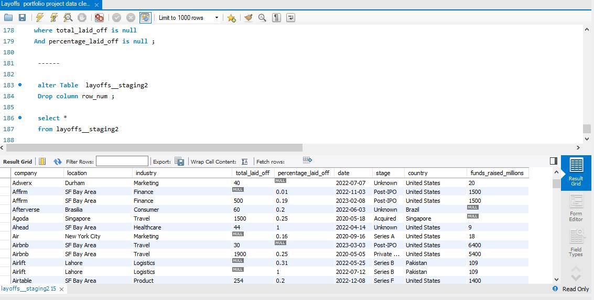
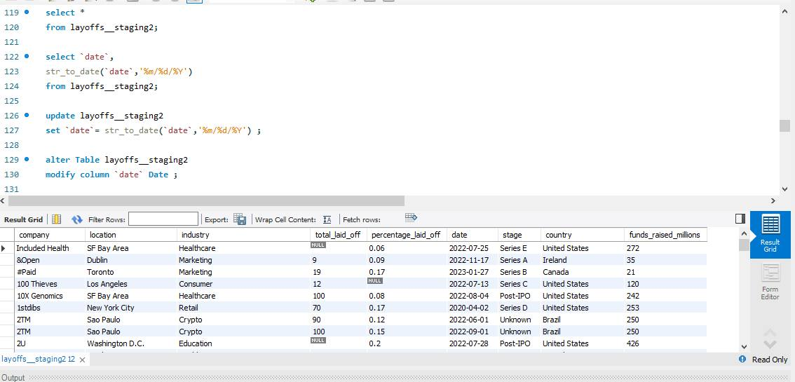
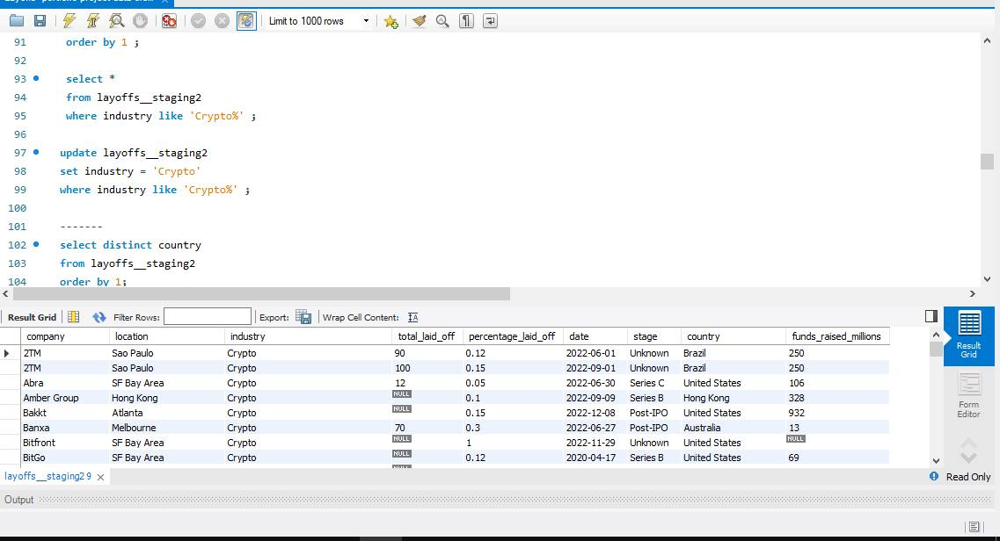
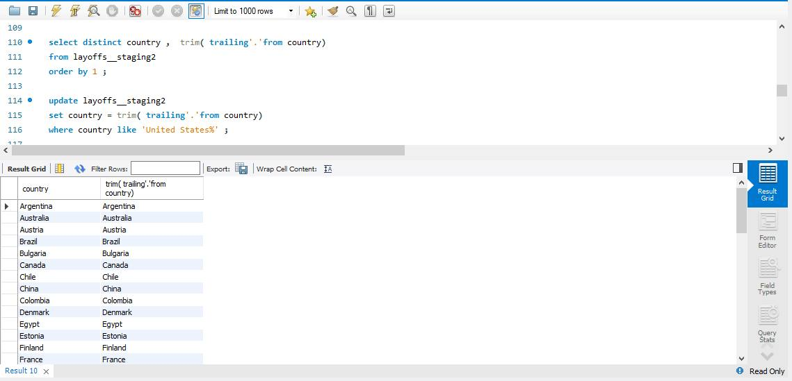
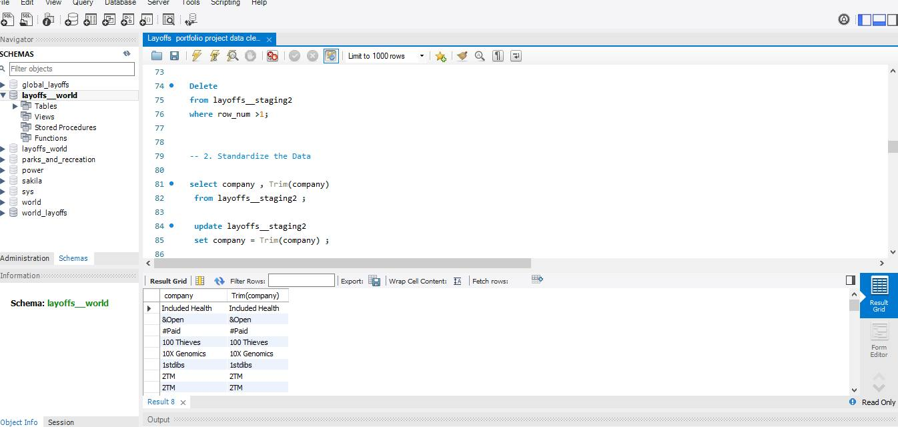
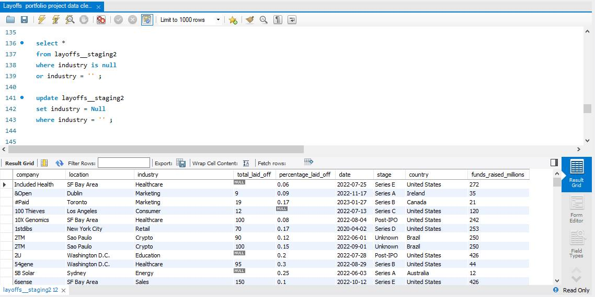

# 💾 Layoffs Data Cleaning (MySQL)

A MySQL-based project focused on cleaning and preparing layoff data for analysis.

---
## 🛠 Tools Used
- MySQL Workbench  
- MySQL (SELECT, UPDATE, DELETE, JOIN, GROUP BY, CTE)
---
## 🎯 Objectives
- Remove duplicates  
- Standardize company names  
- Handle NULL values  
- Ensure data consistency
---
## 📂 Files
- https://github.com/Muna5abdullah/Layoffs-project-data-cleaning/blob/main/Layoffs%20project%20data%20cleaning.sql
---
## 🏆 Key Results
1️⃣ Data Cleaning: Missing and Duplicate Values  
- Removed rows with missing or duplicate values using SQL queries, improving overall data quality.

2️⃣ Standardized Data Formats  
- Converted columns such as dates and numeric fields into consistent formats for easier analysis and querying.

3️⃣ Removed Invalid and Outlier Values  
- Identified and removed invalid or outlier values across different columns, enhancing data accuracy and reliability.
---
## 📷 Sample MySql Process & Code Steps 

---
 
---

---

---

---

---

